# 使用 indexedDB 離線儲存圖片

## 緣起
由於最近碰到要在負責的*網頁式聊天機器人*中，新增如同Line聊天室的貼圖功能，可想而知會有大量的貼圖圖片會需要在用戶裝置瀏覽器進行下載，不管是對圖片伺服器或是用戶等待的過程來說都是不小的負擔。

為了解決這個問題，我使用了 PWA (Progressive Web Application) 技術中常用的離線儲存方案 `indexedDB` 來快取貼圖圖片，不僅減少用戶端與網站伺服器端的連線流量，也提升的用戶體驗(UX: User Experience)。

## Service Worker
Service Worker是一個事件驅動的網站 Worker，根據不同的來源(origin)與網址路徑(path)進行註冊後，之後再次訪問同一網站後即會在背景執行這個 Service Worker。

Service Worker 無法直接存取 DOM 物件，他負責監聽和處理像是 *fetch*, *notification(推播)*, *sync* 還有 *Service Worker 註冊、啟動* 等相關事件。

透過處理上述事件，我們可以讓 web 網頁像一般的手機原生 App 一樣可以執行安裝、發送推播、離線瀏覽及連線後同步等等作業。

## 離線儲存
常見的 Ｗeb 儲存方案有下面幾種:
1. Cookie
2. LocalStorage
3. Cache (precache)
4. indexedDB

一般 SPA (Single Page Application) 中比較常用的是 Cookie 跟 LocalStorage 兩種儲存方法，不過在使用上都會有大小的限制（無法儲存較大的網站資源），像是 LocalStorage 的限制依照瀏覽器不同會落在大約 2MB ~ 10MB 左右，超過後就會發出Error。

而在 PWA 的離線儲存上通常會使用 Cache(precache) 或 indexedDB 來實作，它們的大小通常跟使用者裝置的 disk 空間有關係，以 Chrome 為例，所有網站可以用的共享儲存空間為硬碟可用空間的1/3, 每個網站 App 可以使用共享空間中的 20%。

> 舉例:<br>
> 如果今天硬碟可用空間有 60GB，那麼其中的 1/3 也就是 20GB 會是共享的儲存空間，那每個網站可以用的大小就是這 20GB 中的 20%，也就是 4GB 左右，所以在儲存一般網頁圖片、影片或是聲音檔等資源應該是相當夠用的。
> （ 參考來源: [Chrome Developer](https://developer.chrome.com/docs/apps/offline_storage/#temporary) ）

## 解決方案

在基本理解了 Service Worker 的相關知識後，接下來就是透過 Service Ｗorker 攔截圖片下載的 fetch 事件，然後透過 indexedDB 儲存來快取網站圖片，簡單的流程圖如下:



▲ <i>Service Worker 圖片快取簡略流程圖</i>

## 程式碼實作
在網頁載入時，可以透過 `navigator.serviceWorker.register` 進行 Service Worker 的安裝註冊動作:

```javascript
<script>
  // Check that service workers are supported
  if ('serviceWorker' in navigator) {
    window.addEventListener('load', () => {
      navigator.serviceWorker.register('./sw.js')
        .then(function(registration) {
          console.log('Registration succeeded.');
        }).catch(function(error) {
          console.log('Registration failed with ' + error);
        });
    });
  }
</script>
```

在 *sw.js* 中我們就可以定義攔截 *fetch 事件* 的相關程式邏輯
```javascript
self.addEventListener('fetch', async (event) => {
  const url = new URL(event.request.url);
  if (event.request.destination === 'image' && url.pathname.startsWith('/sticker/')) {
    // Handle sticker images cache here
    event.respondWith(
      cacheMatch(url.pathname)
      .then(sticker => {
        if (sticker !== undefined) {
          /* 0. Sticker image cache found in indexedDB,
                reply with cached payload. */
          return new Response(sticker?.blob)
        } else {
          /* 1. Sticker not found in indexedDB,
                fetch from backend web server. */
          throw new Error(`Sticker not found in DB: ${url.pathname}`);
        }
      })
      .catch(err => {
        console.error(err);
        return fetch(event.request)
          .then(async (httpResponse) => {
              const httpResponseToCache = httpResponse.clone();
              const imgBlob = await httpResponse.blob();
              cachePut({
                id: url.pathname,
                blob: imgBlob
              })
              return httpResponseToCache;
          })
          .catch(err => {
            throw err;
          })
      })
    );
  }
});
```

